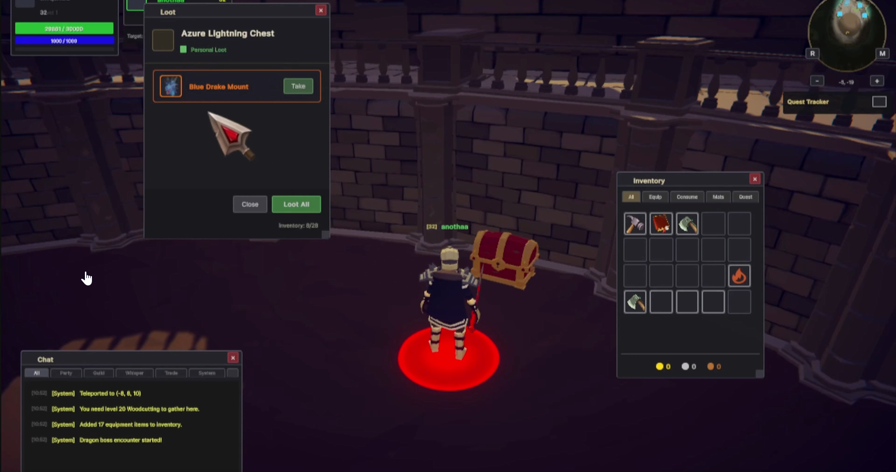
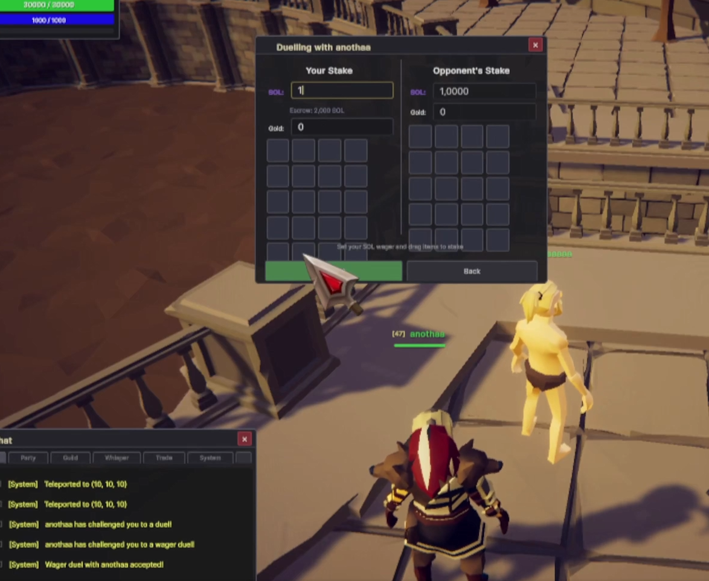
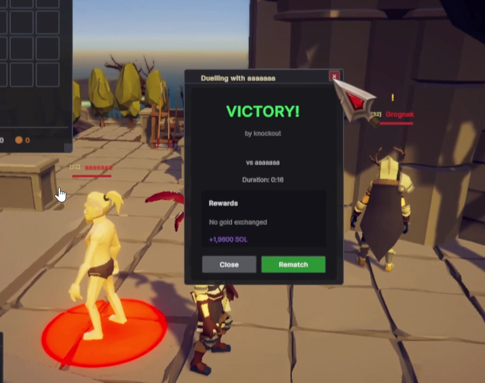
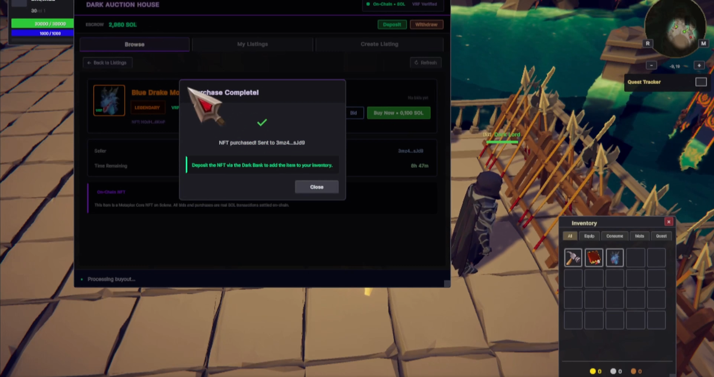
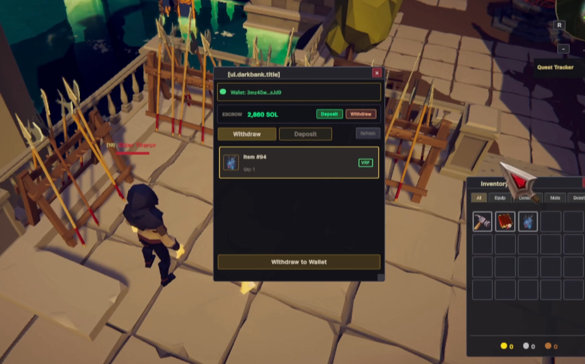

# Alerith — On-Chain MMORPG on Solana

A fully playable MMORPG with on-chain PvP wagering, a provably fair VRF loot system, and an NFT item marketplace — built in Unity with three custom Anchor programs on Solana.

**[Play Alerith](https://alerith.com)** | **[@PlayAlerith](https://x.com/PlayAlerith)** | **[Demo Video](https://x.com/PlayAlerith/status/2028475960190742689)**

---

## What is Alerith?

Alerith is a fully playable MMORPG built in Unity with Mirror networking. It features tick-based combat for the duel arena, ability-style combat for the open world, 16 trainable skills, a quest system, crafting, gathering, and a full creature/NPC ecosystem.

On top of this complete game foundation, we integrated three custom Solana programs to bring trustless economics to the MMO genre without sacrificing gameplay or adding latency.

**Core philosophy:** the game server stays authoritative for game logic (combat, movement, skills) while Solana handles economic settlement (wagering, item ownership, loot provenance). Players get the responsiveness of a traditional MMO with the trustlessness of on-chain verification.

---

## Screenshots

### VRF Loot Drop — Provably Fair Boss Loot (MagicBlock)


### Arena — On-Chain PvP Wager Staking


### Arena — Duel Victory & SOL Payout


### Dark Auction House — NFT Marketplace


### Dark Bank — Withdraw Items to Solana Wallet


---

## Solana Integration: Three Anchor Programs

### 1. Arena — On-Chain PvP Wagering
**Program ID:** `29ZHkMATNJ9kZoeFNhExSiskwk8BL1W6roqaiEQQneYF`

Players stake real SOL on PvP duels. Both players deposit wagers into an on-chain escrow PDA, tick-based combat runs on the game server, and the winner receives 2x their wager minus a small treasury fee. A combat log hash is published on-chain for auditability.

### 2. Marketplace — NFT Item Trading
**Program ID:** `Beva7XHsfKZM7zTZUz4dgXqCxfDM3Xc4wVSx9swYWf3F`

In-game boss drops can be withdrawn to a player's Solana wallet as Metaplex Core NFTs. The on-chain marketplace supports atomic buyouts (SOL to seller, NFT to buyer, fee to treasury — single transaction). Items can be deposited back into the game at any time. NFT metadata encodes full item stats: attack power, quality tier, required level, rarity.

### 3. VRF Loot — Provably Fair Boss Drops (MagicBlock)
**Program ID:** `ENJmHMGDHpa83QvakPL99hPkY18s3KwvMTPrcHGfAStc`

MagicBlock's VRF oracle provides verifiable randomness for boss loot drops:

1. Boss dies -> server publishes a `VrfRequest` PDA on Solana
2. MagicBlock VRF oracle fulfills with a 32-byte random seed
3. Server feeds the seed into a deterministic xoshiro256** PRNG
4. Loot is rolled against the boss's loot table
5. An immutable `LootReceipt` PDA is published with: VRF seed, loot table hash, every item rolled, coin amounts, and player assignments

**Anyone can verify**: download a `LootReceipt`, run xoshiro256** with the VRF seed, and confirm the loot matches. If the server lied, the math won't match. This is cryptographic proof of fair loot — something no traditional MMO can offer.

See [SPONSOR_INTEGRATION.md](SPONSOR_INTEGRATION.md) for the full MagicBlock integration details.

---

## Architecture

```
[Browser - WebGL Client]
    |
    | Mirror Networking (WebSocket)
    |
[Unity Dedicated Server]
    |                          |
    | HTTP (localhost:3003)    | Mirror RPCs
    |                          |
[Express.js Sidecar]       [Game Logic]
    |                       (Combat, Skills,
    | @coral-xyz/anchor     Quests, Crafting)
    |
[Solana Devnet]
    |-- Arena Program (escrow, settlement)
    |-- Marketplace Program (NFT listings, buyouts)
    |-- VRF Loot Program (seed requests, receipts)
    |
[MagicBlock VRF Oracle]
    |-- Fulfills randomness requests
```

The sidecar pattern keeps Solana transaction construction out of the Unity server. The server communicates with the sidecar via HTTP, and the sidecar handles all Anchor instruction building, signing, and submission.

**Authority-operated transactions** let the server sign routine operations without requiring wallet popups for every action. Players only need Phantom for initial authentication and high-value operations.

---

## Repository Structure

```
GraveyardSubmission/
├── README.md                        # This file
├── SUBMISSION.md                    # Hackathon submission form
├── SPONSOR_INTEGRATION.md           # MagicBlock VRF integration deep-dive
│
├── anchor-program/
│   └── alerith_loot_vrf.rs         # Anchor program (Rust) — VRF Loot
│
├── sidecar/
│   ├── vrf-service.ts              # VRF service (TypeScript) — request + poll
│   ├── vrf-routes.ts               # REST API routes for VRF
│   └── vault-service.ts            # NFT mint/burn/query (Metaplex Core)
│
└── game-server/
    ├── VrfLootProvider.cs           # Static delegate bridge (Core assembly)
    ├── SolanaLootService.cs         # Server-side VRF bridge
    └── SeededRandom.cs              # xoshiro256** PRNG (deterministic, cross-platform)
```

---

## Technical Highlights

- **Fully playable MMO**: 16 skills, tick-based combat, quests, crafting, gathering, parties — not a demo, a game
- **WebGL + Phantom**: Runs in the browser with native Phantom wallet integration
- **Three specialized Anchor programs**: Independently deployable and composable
- **xoshiro256** PRNG**: Deterministic across C#, Rust, Python, and JS — anyone can verify loot rolls
- **Zero gameplay latency**: Solana transactions happen asynchronously; combat stays server-authoritative at 600ms ticks
- **Immutable audit trail**: Every duel result, marketplace sale, and loot drop is permanently recorded on-chain

---

## Program IDs (Devnet)

| Program | Address |
|---------|---------|
| Arena | `29ZHkMATNJ9kZoeFNhExSiskwk8BL1W6roqaiEQQneYF` |
| Marketplace | `Beva7XHsfKZM7zTZUz4dgXqCxfDM3Xc4wVSx9swYWf3F` |
| VRF Loot | `ENJmHMGDHpa83QvakPL99hPkY18s3KwvMTPrcHGfAStc` |

---

## Hackathon Tracks

- **Graveyard Hackathon** — Overall (Gaming category)
- **MagicBlock** — VRF for provably fair boss loot drops

## Team

- **[@PlayAlerith](https://x.com/PlayAlerith)**
- **Telegram:** [xTrinks](https://t.me/xTrinks)
